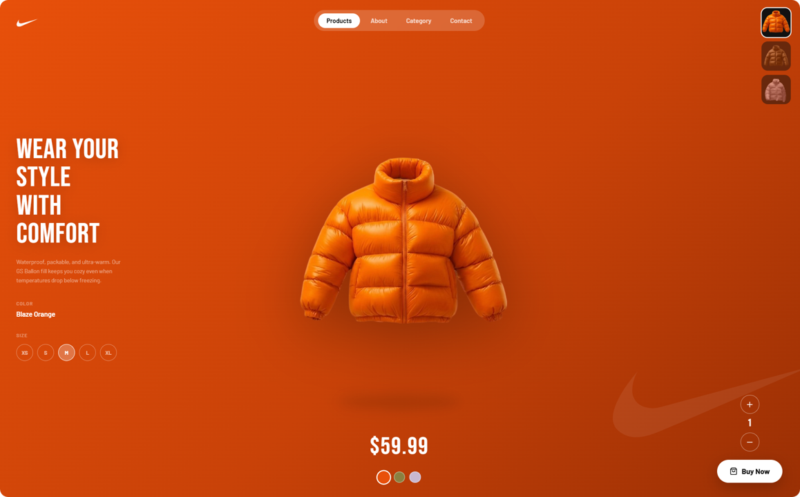

# 🧥 Nike Jacket Store

Producto visual interactivo inspirado en un diseño de tienda Nike, construido con **React + Vite + Tailwind CSS**.

[](https://nike-jacket-store.vercel.app)

---

## ✨ Features

- 🎨 Selector de colores con transición animada entre chaquetas
- 🫧 Animación de flotación en la chaqueta principal
- 🖼️ Thumbnails interactivos para cambiar de producto
- 👕 Selector de tallas (XS, S, M, L, XL)
- ➕ Control de cantidad con íconos Lucide
- 📱 Diseño responsivo

---

## 🛠️ Tech Stack

| Tecnología | Uso |
|---|---|
| React 19 | UI y estado |
| Vite | Bundler y dev server |
| Tailwind CSS 3 | Estilos utilitarios |
| Lucide React | Íconos |

---

## 🚀 Cómo correrlo localmente

```bash
# 1. Clonar el repo
git clone https://github.com/TU_USUARIO/nike-jacket-store.git
cd nike-jacket-store

# 2. Instalar dependencias
npm install

# 3. Correr en desarrollo
npm run dev
```


---

## 📁 Estructura del proyecto

```
nike-jacket-store/
├── public/
│   ├── chaqueta-1.png
│   ├── chaqueta-2.png
│   ├── chaqueta-3.png
│   └── logo-nike.png
├── src/
│   ├── components/
│   │   ├── JacketSlide.jsx     ← slide principal
│   │   ├── Navbar.jsx
│   │   ├── ThumbnailStrip.jsx
│   │   ├── ColorDots.jsx
│   │   ├── SizeSelector.jsx
│   │   ├── QuantityControl.jsx
│   │   └── NikeSwoosh.jsx
│   ├── data/
│   │   └── jackets.js          ← datos de cada chaqueta
│   ├── App.jsx
│   └── main.jsx
├── tailwind.config.js
└── package.json
```

---

## 🌿 Git Flow

Este proyecto sigue la metodología **Git Flow**:

```
main        ← producción (estable)
develop     ← integración de features
feature/*   ← ramas de trabajo
```

**Para contribuir o agregar una feature:**

```bash
git checkout develop
git checkout -b feature/nombre-de-tu-feature

# ... trabajas y haces commits ...
git add .
git commit -m "feat: descripción del cambio"
git push origin feature/nombre-de-tu-feature

# Luego abres un Pull Request en GitHub: feature/* → develop
```

---

## 📦 Scripts disponibles

```bash
npm run dev      # servidor de desarrollo
npm run build    # build para producción
npm run preview  # previsualizar el build
```

---

## 👩‍💻 Autora

**Yadhira Saavedra** 

[GitHub](https://github.com/yxdhii)

---

> Proyecto creado con fines de aprendizaje y práctica de UI/UX con React.